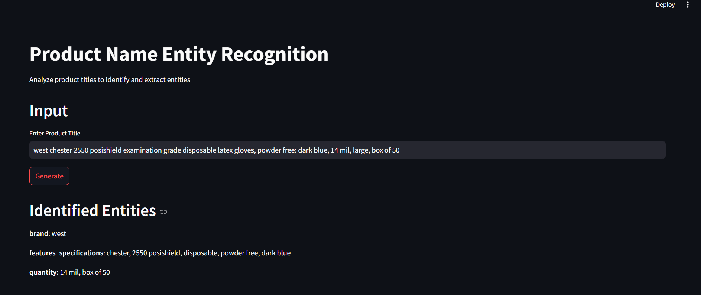

# Commands to run the files
```shell
> conda create -n product-ner-env python=3.10
> conda activate product-ner-env
> pip install fastapi uvicorn streamlit requests spacy
> uvicorn api:app --reload
> streamlit run app.py
```

# Running App ScreenShot
